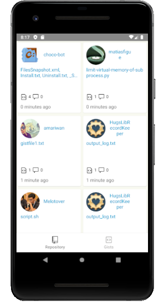
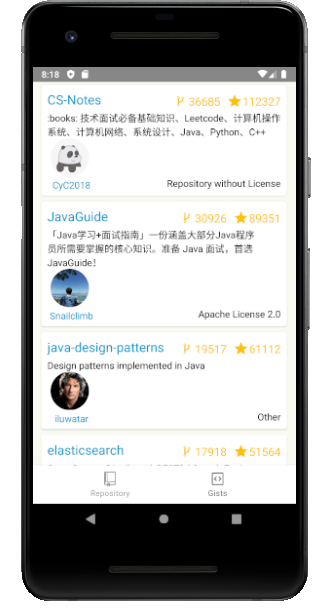

<h1 align="center">
     <a href="#" alt=""> Aula pós gradução 2019  </a>
</h1>

<h4 align="center">
	🚧   Concluído 🚀 🚧
</h4>

Tabela de conteúdos
<!--ts-->
   * [Sobre o projeto](#-sobre-o-projeto)
   * [Funcionalidades](#-funcionalidades)
   * [Como executar o projeto](#-como-executar-o-projeto)
     * [Pré-requisitos](#pré-requisitos)
     * [Rodando o Projeto](#user-content--rodando-o-backend-servidor)

<!--te-->


## 💻 Sobre o projeto

Api feita durante aula android 

---

## ⚙️ Funcionalidades

- [x] Aprender sobre e pesquisar sobre
  - [x] cilclo de vida de uma aplicao android 
  - [x] sobre api 
  - [x] kolin 
  
---

## 🎨 Layout

O layout da aplicação:

### Mobile

<p align="center">
  

<p align="center">
  

---

## 🚀 Como executar o projeto

### Pré-requisitos

Antes de começar, você vai precisar ter instalado em sua máquina as seguintes ferramentas:
[Git](https://git-scm.com),  
Além disto é ter o editor para trabalhar com o código [Android Studio](https://developer.android.com/studio)

#### 🎲 Rodando o Projeto

```bash

# Clone este repositório
$ git clone git@github.com:leandrojsantos/android.git

# Acesse a pasta do projeto com android studio
$ aula2019

# com emulador ou dipositivo aberto de play no projeto

```
